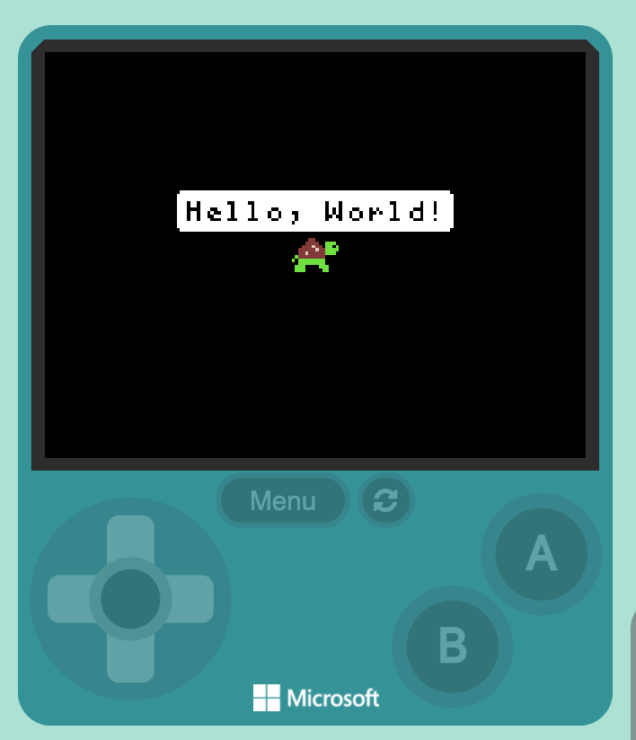

### @explicitHints true

```template
let myTurtle = turtle.fromSprite(sprites.create(img`
    . . . . . . . . . . . . . . . . 
    . . . . . . . . . . . . . . . . 
    . . . . . . . . . . . . . . . . 
    . . . . . . e e . . . . . . . . 
    . . . . . e e e e . . 7 7 7 . . 
    . . . . e e e d e e . 7 7 f 7 . 
    . . . e e e e e d e e 7 7 7 7 . 
    . . . e e d e e e e e 7 7 7 . . 
    . . 7 e e e e e e e e . . . . . 
    . 7 . 7 7 7 7 7 7 7 7 . . . . . 
    . . . 7 7 7 7 7 7 7 7 . . . . . 
    . . 7 7 7 . . . . 7 7 7 . . . . 
    . . 7 7 7 . . . . . 7 7 . . . . 
    . . . . . . . . . . . . . . . . 
    . . . . . . . . . . . . . . . . 
    . . . . . . . . . . . . . . . . 
    `, SpriteKind.Player))
```

# Turtle Logo - "Hello, World!"

## Step 1
**Turtle Logo - "Hello, World!"**

Welcome to coding with Turtle Logo. Turtle Logo uses MakeCode Arcade to teach the fundamentals of programming. You will drag blocks of code into a sequence of steps to tell the "turtle" what to do. You can see the output in the game controller on the left hand side.


## Step 2
**Turtle Logo - "Hello, World!"**

It is tradition with programmers when they start using a new programming language to get the computer to say "Hello, World!" back to them. This might seem strange, but just getting the computer to say something back to you can sometime be complex.


## Step 3
**Turtle Logo - "Hello, World!"**

You will need 3 blocks to make this happen and the first two are already provided. All programs will have an "on start" block. This block runs all the commands that are inside it as soon as the program start running. 

## Step 4
**Turtle Logo - "Hello, World!"**

Next you will need to create your turtle. To do this you will use the "set myTurtle to turtle of sprite XX of kind PLayer". Each new turtle object in your game will need one of these. This creates the object and gives it a name (or more technically a variable) that you can use to reference your object.

## Step 5
**Turtle Logo - "Hello, World!"**

Now that we have a turtle object, you can ask it to say something. Drag out the "myTurtle say "Hello, World!" block and place it after the first one. 
Success!
Notice to the left, your object is now saying "Hello, World" for 1 second and then it words vanish.